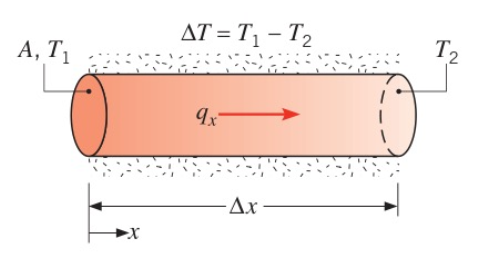

# Week 7

# Introduction to Heat Transfer

- Definition of Heat Transfer: Heat Transfer is thermal energy in transit due to a spatial temperature difference.
- Three different types of heat transfer modes
    - Conduction
        - Mainly occurred in solid, e.g., In a cup filled with hot water, heat is transferred from the inner surface contacted with the hot water to the outer surface.
    - Convection
        - Mainly occurred in fluid & solid, e.g., wind and skin.
    - Radiation
        - All objects emit radiation all the time.
- First law of thermodynamics
    - The increase in the amount of energy stored in a control volume ($\Delta E_{st}$) must equal the amount of energy that enters the control volume ($E_{in}$), minus the amount the amount of energy that leaves the control volume ($E_{out}$), plus the amount of energy that is generated within the control volume.
        
        $$
        \Delta E_{st}=E_{in}-E_{out}+E_{g}
        $$
        
        Take the derivative respect to time on both sides,
        
        $$
        \dot{\Delta E_{st}}=\dot{E_{in}}-\dot{E_{out}}+\dot{E_{g}}
        $$
        
        Since $\dot{\Delta E_{st}}=\dot{E_{st}}$, this equation can also be written as,
        
        $$
        \dot{E_{st}}=\dot{E_{in}}-\dot{E_{out}}+\dot{E_{g}}
        $$
        
        These four items represent the rate of change of energy (Power).
        
        
        
    - Internal Energy

# Conduction

## Conduction Rate Equation (Fourier’s Law)

- **Fourier’s Law is summarized from experimental phenomena**, which holds for different material
    
    $$
    q_x=kA\frac{\Delta T}{\Delta x}
    $$
    
    where $q_x$ is the heat transfer rate with the unit in W (Watt). $k$ is a constant and varies from materials, defined as thermal conductivity. $\Delta T$ and $\Delta x$ are the temperature difference and the length between two points. $A$ is the cross-sectional area, which is perpendicular to the direction of $\Delta x$. In this equation, $\Delta T$ and $\Delta x$ are scalar and positive (direction-less), which gives a positive $q_x$, since heat transfer rate measures power.
    
    
    
- In contrast, heat flux $q_x''$ is defined as a vector quantity.
    
    $$
    q_x''=-k\frac{dT}{dx}
    $$
    
    From the zeroth law of thermodynamics, heat is always transferred from the higher temperature point to lower temperature point. Hence, the direction of heat transfer should start from the higher temperature point to the lower temperature point, which should be the same with the direction of heat flux. In the figure above, the origin of $x$  is at the left end of the cylinder and the positive direction of $dx$ points to the right. If the left end is the higher temperature end, $\frac{dT}{dx}$ should be negative. With the negative sign in expression, $q_x''$ is positive in the direction of $dx$, which is compatible with the zeroth law of thermodynamics.
    
    Since heat flux is a vector quantity, it can be extended to the 3 dimensional case. In cartesian coordinate system,
    
    $$
    q_n''=-k_n(\underbrace{\frac{\partial T}{\partial x}\bold{i}+\frac{\partial T}{\partial y}\bold{j}+\frac{\partial T}{\partial z}\bold{k})}_{a~certain~direction~\bold{n}}
    $$
    
    where $k_n$ is the thermal conductivity along a certain direction $\bold{n}$. If the material is isotropic, which means that the thermal conductivity is the same in all direction, $k_x=k_y=k_z=k_{any~direction}=k$. Hence, equation above can be rewritten as
    
    $$
    q''=q_x''\rm{i}+q_y''\rm{j}+q_z''\rm{k}\\q_x''=-k\frac{\partial T}{\partial x},~q_y''=-k\frac{\partial T}{\partial y},~q_z''=-k\frac{\partial T}{\partial z}
    $$
    

## Thermal Conductivity

- **In general, the thermal conductivity of a solid is larger than that of a liquid, which is larger than that of a gas.** Since the intermolecular spacing is largest in gas, then liquid and solid. The thermal energy (heat) is mainly transferred by the collision of molecules. When the intermolecular spacing between two molecules gets larger, the energy transfer efficiency through collision gets lower, which leads to lower thermal conductivity.

## Heat Diffusion Equation

- Derivation
    
    In a control volume, a cubic with volume $dxdydz$ as shown below,
    
    
    
     From the first law of thermodynamics (Conservation of energy),
    
    $$
    \dot{E_{st}}=\dot{E_{in}}-\dot{E_{out}}+\dot{E_{g}}
    $$
    
    From thermal dynamics, suppose there is no phase change (no latent energy), for this control volume,
    
    $$
    \dot{E_{st}}=\frac{\partial U_{sensible}}{\partial t}=\rho C_{p}\frac{\partial T}{\partial t}dxdydz
    $$
    
    where $\rho$ and $C_p$ are the density and the specific heat of the material.
    
    Suppose the heat is transferred in all 3 dimensions, i.e., $q_x$, $q_y$, $q_z\ne0$. Since the heat transfer rate is a scalar quantity, the total heat transfer rate into the control volume is simply the algebraic sum of the heat transfer rate on different contacting surface.
    
    $$
    \dot{E_{in}}=q_x+q_y+q_z\\\dot{E_{out}}=q_{x+dx}+q_{y+dy}+q_{z+dz}
    $$
    
    Note that when we write the expressions above, we assume the temperatures on faces $x$, $y$, $z$ are higher than temperatures on surfaces $x+dx$, $y+dy$, $z+dz$, due to the zeroth law of thermodynamics.
    
    The last term is the heat generation rate in the control volume,
    
    $$
    \dot{E_g}=\dot{q}dxdydz
    $$
    
    where $\dot{q}$ is the rate at which energy is generated per unit volume ($W/m^3$).
    
    Substitute these expressions into the equation of Conservation of energy,
    
    $$
    \rho C_{p}\frac{\partial T}{\partial t}dxdydz=q_x+q_y+q_z-(q_{x+dx}+q_{y+dy}+q_{z+dz})+\dot{q}dxdydz
    $$
    
    From Taylor Series Expansion,
    
    $$
    \small q_{x+dx}=q_x+\frac{dq_x}{dx}dx+\small{higher~order~term}\\q_{y+dy}=q_y+\frac{dq_y}{dy}dy+\small{higher~order~term}\\q_{z+dz}=q_z+\frac{dq_z}{dz}dz+\small{higher~order~term}
    $$
    
    With Fourier’s law, note that since $q_{x,y,z}$ is always a positive quantity, when we take the $\Delta x$ in the expression of $q_x$ approach to zero or $dx$, the term $\frac{dT}{dx}$ will be negative, since $T_{x+dx}\lt T_{x}$ (the same operations on $q_y$ and $q_z$). Hence, we need to manually add a minus sign in this situation, which gives
    
    $$
    \small q_{x}=kA\frac{\Delta T}{\Delta x}\implies q_x=-kA\frac{dT}{dx} (tha~same~with~q_y,~q_z)
    $$
    
    In this 3-dimensional situation, temperature $T$ is the function of $x ,y,z$, which gives,
    
    $$
    \frac{dq_x}{dx}=\frac{d}{\partial x}(-k_xA_x\frac{\partial T}{\partial x}),~\frac{dq_y}{dy}=\frac{\partial}{\partial y}(-k_yA_y\frac{\partial T}{\partial y}),~\frac{dq_z}{dz}=\frac{d}{\partial z}(-k_zA_z\frac{\partial T}{\partial z})\\A_x=dydz,~A_y=dxdz,~A_z=dxdy
    $$
    
    Hence, the equation of Conservation of energy becomes,
    
    $$
    \footnotesize \rho C_{p}\frac{\partial T}{\partial t}dxdydz=\frac{\partial}{\partial x}(k_x\frac{\partial T}{\partial x})dxdydz+\frac{\partial}{\partial y}(k_y\frac{\partial T}{\partial y})dxdydz+\frac{\partial}{\partial z}(k_z\frac{\partial T}{\partial z})dxdydz+\dot{q}dxdydz\\ \implies\rho C_{p}\frac{\partial T}{dt}=\frac{\partial}{\partial x}(k_x\frac{\partial T}{\partial x})+\frac{\partial}{\partial y}(k_y\frac{\partial T}{\partial y})+\frac{\partial}{\partial z}(k_z\frac{\partial T}{\partial z})+\dot{q}\tag{*}
    $$
    
    **Equation (*) is the general form of heat transfer function in 3-dimensional case in cartesian coordinate system**.
    
    - Also **in cylindrical coordinate system $(r,\phi,z)$**, it becomes
    
    $$
    \frac{1}{r}\frac{\partial}{\partial r}(k_r r\frac{\partial T}{\partial r})+\frac{1}{r^2}\frac{\partial}{\partial \phi}(k_{\phi}\frac{\partial T}{\partial \phi})+\frac{\partial}{\partial z}(k_{z}sin\frac{\partial T}{\partial z})+\dot{q}=\rho C_p\frac{\partial T}{\partial t}
    $$
    
    - **In spherical coordinate system $(r,\phi,\theta)$,**
    
    $$
    \small\frac{1}{r^2}\frac{\partial}{\partial r}(k_r r^2\frac{\partial T}{\partial r})+\frac{1}{r^2sin^2\theta}\frac{\partial}{\partial \phi}(k_{\phi}\frac{\partial T}{\partial \phi})+\frac{1}{r^2sin\theta}\frac{\partial}{\partial \theta}(k_{\theta}sin\theta\frac{\partial T}{\partial\theta})+\dot{q}=\rho C_p\frac{\partial T}{\partial t}
    $$
    
    There are three simplified cases when using equation (*),
    
    1. If only one kind of isotropic material is used, then the thermal conductivity is the same in all direction,
        
        $$
        \frac{\partial ^2T}{\partial x^2}+\frac{\partial ^2T}{\partial y^2}+\frac{\partial ^2T}{\partial z^2}+\frac{\dot{q}}{k}=\frac{\rho C_p}{k}\frac{\partial T}{\partial t}=\frac{1}{\alpha}\frac{\partial T}{\partial t},~\alpha=\frac{k}{\rho C_p}
        $$
        
    2. If steady-state condition is considered, there is no change in the amount of energy stored in the material, i.e., $\dot{E_{st}}=0\implies\frac{\partial T}{\partial t}=0$,
        
        $$
        \frac{\partial}{\partial x}(k_x\frac{\partial T}{\partial x})+\frac{\partial}{\partial y}(k_y\frac{\partial T}{\partial y})+\frac{\partial}{\partial z}(k_z\frac{\partial T}{\partial z})+\dot{q}=0
        $$
        
    3. If steady-state condition is considered $(\dot{E_{st}}=0\implies\frac{\partial T}{\partial t}=0)$ in the one-dimensional case (only $x$ direction is considered) with no heat generation in the material $(\dot{E_g}=0)$, 
        
        $$
        \frac{d}{d x}(k_x\frac{d T}{d x})=0
        $$
        
        In this simplest case, from Fourier’s law, $q_x''=-k_x\frac{dT}{dx}$,
        
        $$
        \frac{d}{d x}(k_x\frac{d T}{d x})=0\implies\frac{dq_x''}{dx}=0
        $$
        
        which means that **the heat flux $q_x''$ is a constant along the x direction**. Note that only without heat generation $(\dot{E_g}=0)$ in the material, this phenomenon exists.
