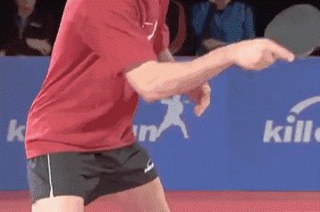
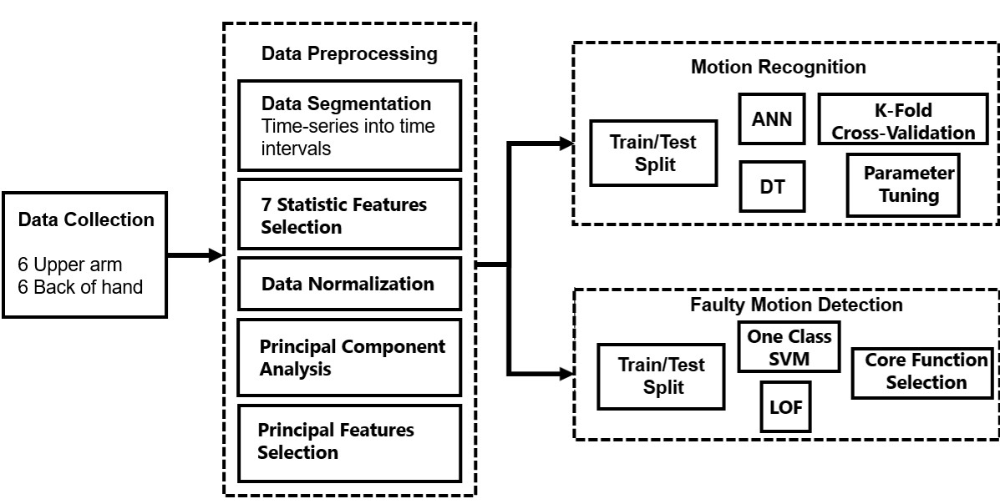
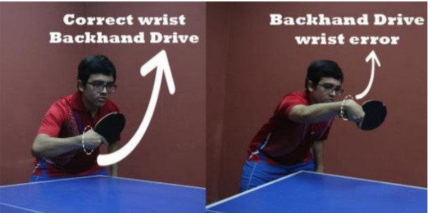

# Motion Analysis Based on Inertial Measurement Unit Sensors: Guidance to Novice Ping-Pong Players' Training
This web page is maintained for sharing the project materials in Big Data Analytics and Applications in Industry, 2021 fall. Welcome to email me <202030101256@mail.scut.edu.cn>.

# Abstract
With the development of wearable technology and inertial sensor technology, the application of wearable sensors in the field of sports is becoming more extensive. IMU (Inertial Measurement Unit) is a kind of sensor that measures tri-axial accelerations and tri-axial angular velocities, which has been integrated in many devices such as the smart phone, smart watch and other integrated sensors. In this project, we use two devices with each containing one IMU sensor fixed with the subject to collect inertial characteristic data while the subject is playing ping-pong (table tennis). In the data preprocessing, we conduct time-series 
segmentation, features selection and dimension reduction using PCA (Principal Component Analysis). Then, we directly choose several important principal 
components as new features feeding into machine learning models. We ensemble ANN (Artificial Neuron Network) and DT (Decision Tree) to achieve binary motion recognition, to recognize two kinds of motion, the forehand drive and backhand stroke. In addition, based on OCSVM (One Class Support Vector Machine) and LoF (Local Outlier Factor) learning model, we also achieve the faulty motion detection which may cause damage to players’ wrist. We believe that this project will assist and give guidance to the training process of novice ping-pong players.  
***Keywords: Wearable technology; Inertial Measurement Unit; Ping-Pong (Table Tennis); Motion Recognition; Faulty Motion Detection; Data Mining.***

# Project Materials

## Report
[Click here to download the pdf form of our report.](Project_2_Report_PPP.pdf)

## Overview

sdss

<figure markdown>
  { width="500" }
  <figcaption>Project Overview</figcaption>
</figure>

<figure markdown>
  { width="500" }
  <figcaption>Correct and wrong wrist motion, both of which can be recognized by OCSVM and LoF techniques.</figcaption>
</figure>
